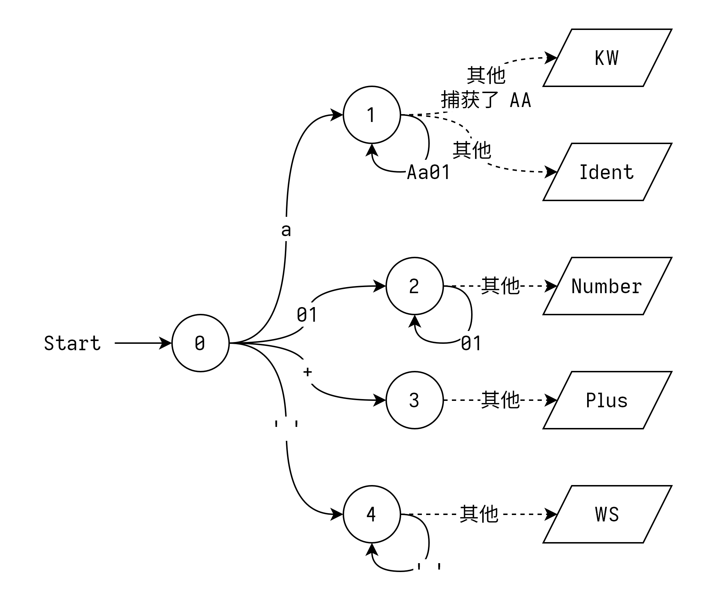

# LAB1 实现指导

这次我们实现的是编译的第一步——词法分析。

词法分析的作用是将输入的字节流/字符流转换成单词（Token）序列，本质上就是使用一组正则表达式不断地匹配输入流，在每次匹配出结果之后输出当前结果，并且返回开始状态准备匹配下一个。

> ~~嗯……我其实挺想用允许自动化工具的，可是那样这个实验不就没意义了吗！~~

## 引入

举个例子！比如咱们现在有一个语法，其中只有四种单词，长下面这样 _（顺便一提，这种风格的 EBNF 你们之后还会见到很多次……）_：

```plaintext
Ident  -> [Aa] [Aa01]*  // 标识符
Number -> [01]+         // 数字
Add    -> '+'           // 加号
WS     -> ' '+          // 空白（之后会被丢弃）
```

那么我们可以构造这样一个自动机：


其中的虚线代表我们不读入这个字符，只获取它的值。这种操作一般称作为 `unread`（读入之后再放回去）或者 `peek`/`lookahead`（偷看输入的下一个值）。

看起来没啥问题。你可以自己模拟运行一下，看看这个自动机是不是将每个合法的句子都转换成了对应的单词序列。

那么如果我们再加一种单词，关键字 `KW -> 'AA'` 呢？自然，我们可以先把 `0 -A-> X -A-> Y --> /KW/` 这条规则加到 NFA 里面，然后简化成 DFA，最终大概长这样：


——作为自动化工具生成的结果没啥问题，但是关键字多一些的话手工实现就比较难了。所以，在手工实现的时候我们一般采取下面这种方法：

注意到关键字 `AA` 是一个合法的标识符，那么我们完全可以在识别完标识符之后再去判断它等不等于 `AA`。于是，我们可以这么设计自动机：



是不是看起来好多了？

实际上，这种操作是广泛存在的——绝大多数编程语言的关键字都被设计成了合法的标识符，以此来降低词法分析的设计难度（以及自动机的状态数）。类似地，很多语言还会尽可能将不同单词的起始字符设计成互不重合的（也就是让自动机比起 “网” 长得更像一个 “树”），这样也可以尽量减少词法分析的难度。

> 你问例外？Java 最近新加了个关键字叫 `non-sealed`，设计者估计脑子有泡……

## 上手编写

说了这么多，来上手写一个吧！

对于输入流，我们可以采用一个实现了 `Peekable` 的迭代器（Java 用户可以用我们提供的 `PeekableCharIter`，Rust 用户可以用标准库的 `std::iter::Peekable`）。下面我们用 `peek()` 代表预读下一个字符，`next()` 代表前进到一个字符。

先创建相应的数据结构：

```java
class Lexer {
    /** 输入数据 */
    PeekableCharIter iter;
    /** 构造单词内容的地方 */
    StringBuilder sb;
    
    /** 移到下一个字符 */
    void next() {
        char ch = iter.next();
        sb.add(ch);
    }

    /** 错误处理，当然我们没有 */
    void error() {
        throw new RuntimeException();
    }

    /** 获取当前单词字符串 */
    String take() {
        String s = sb.toString();
        sb.clear();
        return s;
    }

    /** 我们的单词产生函数 */
    Token nextToken() {
        char ch = iter.peek();
        // TODO: 写一个状态机
    }
}
```

如果你喜欢原教旨主义状态机，请自便——下面我们编写的是一个更加简化的实现。

比如说我们要解析 `Ident -> [Aa] [Aa01]*` 这个单词，我们大概就要在 `nextToken` 里这么写：

```java
Token nextToken() {
    // ...
    if (ch == 'a' || ch == 'A') {
        // 吃掉这个字符
        next();
        // 剩下的事情我们放到这里做
        return lexIdentRest();
    } else {
        // 其他情况
        error();
    }
}

/** 解析一个标识符 */
Token lexIdentRest() {
    // 下一个字符依然可以构成标识符
    if ("Aa01".indexOf(iter.peek()) != -1) {
        next();
    }
    // 取出我们识别到的单词
    String token = take();

    // 判断是不是关键字，返回单词，大概这样
    if (token == "AA") {
        return new Token(TokenKind.AA, token);
    } else {
        return new Token(TokenKind.Ident, token);
    }
}
```

不难对吧，那我们多加几种情况：

```java
Token nextToken() {
    // ...
    else if (ch == '0' || ch == '1') {
        // Number
        next();
        return lexNumberRest();
    } else if (ch == '+') {
        // Add
        next();
        return new Token(TokenKind.Add, take());
    } else if (ch == ' ') {
        // WS
        while (iter.peek() == ' ') next();
        return new Token(TokenKind.WS, take());
    } else if (ch == -1) {
        // 文件结尾 (EOF)
        return new Token(TokenKind.EOF, null);
    } else {
        // 其他情况
        error();
    }
}

Token lexNumberRest() {
    // 当依然能构成数字的时候继续
    while (ch == '0' || ch == '1') next();
    return new Token(TokenKind.Number, take());
}
```

这样一个简单的词法分析器就写完了，好耶！

仿照这个示例，你就能把实验要求的词法分析器写出来了。

> ……什么，你想知道参考实现里的词法分析器是怎么写的？
> 
> 当然是自动生成的啦！欸嘿 (\*/ω＼\*)

## 输出

挨个 `println` 不就好了？
